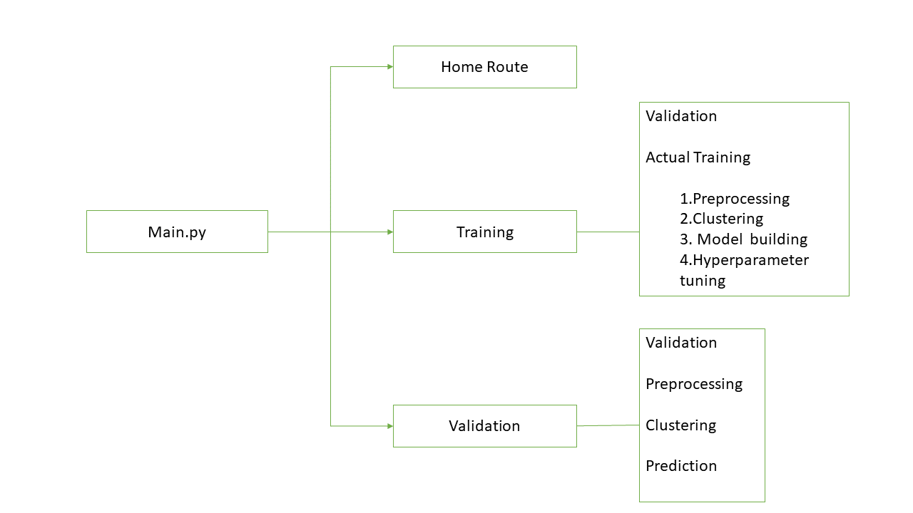

## Badges

Add badges from somewhere like: [shields.io](https://shields.io/)

[](https://www.python.org/downloads/release/python-360/)

[](https://shields.io/)
# Insurance Fraud Detection using Machine Learning
classification methodology to determine whether a customer is placing a fraudulent insurance claim.
### Description
In this project We are using two algoritms “SVM” and "XGBoost". For each cluster, both the algorithms are passed with the best parameters derived from GridSearch. We calculate the AUC scores for both models and select the model with the best score. Similarly, the model is selected for each cluster. All the models for every cluster are saved for use in prediction.


## Architecture

 


Data Ingestion---Involves following steps

                1.Validating Data against predecided format
                2.Data transformation for database insertion
                3.Data insertion into Database

Model Training---Involves following steps

                1.Data preprocessing
                2.Clustering the Data
                3.Getting best model for each cluster
                4.Hyperparameter tunning
                5.Saving model
prediction or test data is subjected to steps in data ingestion and model training
                


## Flask Application  


## Data description
The data contains the following attributes:
Features:

1.	months_as_customer: It denotes the number of months for which the customer is associated with the insurance company.
2.	age: continuous. It denotes the age of the person.
3.	policy_number: The policy number.
4.	policy_bind_date: Start date of the policy.
5.	policy_state: The state where the policy is registered.
6.	policy_csl-combined single limits. How much of the bodily injury will be covered from the total damage.
https://www.berkshireinsuranceservices.com/arecombinedsinglelimitsbetter  
7.	policy_deductable: The amount paid out of pocket by the policy-holder before an insurance provider will pay any expenses.
8.	policy_annual_premium: The yearly premium for the policy.
9.	umbrella_limit: An umbrella insurance policy is extra liability insurance coverage that goes beyond the limits of the insured's homeowners, auto or watercraft insurance. It provides an additional layer of security to those who are at risk of being sued for damages to other people's property or injuries caused to others in an accident.
10.	insured_zip: The zip code where the policy is registered.
11.	insured_sex: It denotes the person's gender.
12.	insured_education_level: The highest educational qualification of the policy-holder.
13.	insured_occupation: The occupation of the policy-holder.
14.	insured_hobbies: The hobbies of the policy-holder.
15.	insured_relationship: Dependents on the policy-holder.
16.	capital-gain: It denotes the monitory gains by the person.
17.	capital-loss: It denotes the monitory loss by the person.
18.	incident_date: The date when the incident happened.
19.	incident_type: The type of the incident.
20.	collision_type: The type of collision that took place.
21.	incident_severity: The severity of the incident.
22.	authorities_contacted: Which authority was contacted.
23.	incident_state: The state in which the incident took place.
24.	incident_city: The city in which the incident took place. 
25.	incident_location: The street in which the incident took place.
26.	incident_hour_of_the_day: The time of the day when the incident took place.
27.	property_damage: If any property damage was done.
28.	bodily_injuries: Number of bodily injuries.
29.	Witnesses: Number of witnesses present.
30.	police_report_available: Is the police report available.
31.	total_claim_amount: Total amount claimed by the customer.
32.	injury_claim: Amount claimed for injury
33.	property_claim: Amount claimed for property damage.
34.	vehicle_claim: Amount claimed for vehicle damage.
35.	auto_make: The manufacturer of the vehicle
36.	auto_model: The model of the vehicle. 
37.	auto_year: The year of manufacture of the vehicle. 


Target Label:
Whether the claim is fraudulent or not.
38.	fraud_reported:  Y or N

## Exploratory Data Analysis

[EDA](EDA/EDA_fraudDetection.ipynb)

# How run it?

### STEPS:
Clone the Repository

```bash
  https://github.com/Naveen0821/Income_prediction.git
```
### STEP 01- Create a conda environment after opening the repository

```bash
  conda create -n Insurance_fraud_detection python=3.6 -y

```
```bash
  conda activate Insurance_fraud_detection

```
### STEP 02- install the requirements
```bash
  pip install -r requirements.txt

```
```bash
  python main.py

```
once application is up and running we have routes for training and prediction.After running training , prediction is made for all the clusters, the predictions along with the names are saved in a CSV file at a given location, and the location is returned to the client.


